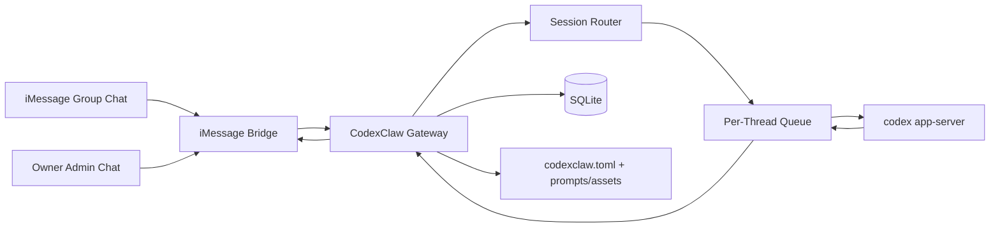

# CodexClaw Architecture

## Purpose

CodexClaw is a thin control layer on top of `codex app-server`.

Codex does the agent work.
CodexClaw does the messaging, routing, queueing, and approvals.

The first target is:

- an iMessage-based assistant
- in a group chat
- that only responds when mentioned

## System Boundary

### Codex owns

- thread persistence
- turn execution
- item and event streaming
- tools, shell, file edits, and approvals protocol
- skills, apps, and AGENTS.md behavior

### CodexClaw owns

- iMessage integration
- mention detection
- chat-to-thread mapping
- per-thread queueing
- owner approval flow
- configuration and runtime metadata

## Core Rules

1. One external chat maps to one Codex thread.
2. One Codex thread has at most one active turn at a time.
3. CodexClaw uses `personality = "none"` and sends full custom `developer_instructions`.
4. Risky actions are never approved in the group chat.
5. The owner approves or denies actions through a private admin iMessage chat.

## High-Level Architecture

## Core Components

### iMessage Bridge

The bridge connects CodexClaw to Messages.

Responsibilities:

- receive incoming messages
- identify chat and sender
- detect mentions
- send replies back to iMessage
- carry private approval prompts to the owner

## Gateway

The gateway is the main application service.

Responsibilities:

- normalize incoming messages
- load configuration
- store runtime metadata
- create runs
- coordinate approvals
- send final replies

## Codex Client

CodexClaw runs a long-lived `codex app-server` process and talks to it over `stdio`.

Responsibilities:

- initialize the JSON-RPC connection
- create or resume threads
- start turns
- consume item and turn events
- handle server-initiated approval requests

## Session Router

The router maps an external conversation to a Codex thread.

Initial mapping:

- `imessage chat_guid -> codex_thread_id`

This mapping is simple on purpose.

## Per-Thread Queue

The queue prevents multiple overlapping turns on the same thread.

Responsibilities:

- ensure only one active turn per thread
- queue follow-up mentions
- guard against duplicate delivery and retries

Default rule:

- if a new message arrives while a thread is busy, enqueue it

## Approval Handler

Approvals are handled outside the group chat.

Flow:

- App Server asks for approval
- Gateway stores a pending approval
- Gateway sends a private iMessage to the owner
- owner replies with a strict command like `APPROVE <id>` or `DENY <id>`
- Gateway responds to App Server

## Persistence

Use three storage layers.

### 1. `codexclaw.toml`

For static app behavior:

- bot name
- mention aliases
- admin chat id
- allowed chats
- workspace root
- default Codex settings
- prompt file paths

### 2. prompt and asset files

For long-lived prompt material:

- system prompt
- approval prompt text
- avatar or reference image

### 3. SQLite

For mutable runtime state:

- chat sessions
- Codex thread ids
- runs
- pending approvals

## Minimal Data Model

### chat_sessions

- `id`
- `channel`
- `external_chat_id`
- `display_name`
- `codex_thread_id`
- `created_at`
- `updated_at`

### messages

- `id`
- `chat_session_id`
- `external_message_id`
- `sender_display_name`
- `raw_text`
- `received_at`

### runs

- `id`
- `chat_session_id`
- `codex_turn_id`
- `status`
- `started_at`
- `completed_at`

### approvals

- `id`
- `run_id`
- `request_id`
- `kind`
- `thread_id`
- `turn_id`
- `item_id`
- `payload_json`
- `status`
- `decided_at`

## Prompt Strategy

Each Codex thread should be started with:

- `personality = "none"`
- full custom `developer_instructions`
- optional avatar or reference image on the first turn

Suggested behavior:

- respond only when mentioned
- keep replies concise in group chat
- prefer explanation before action
- require approval for risky side effects

## Runtime Flow

### Message Flow

1. A message arrives in the iMessage group.
2. The bridge checks whether CodexClaw was mentioned.
3. The gateway loads or creates the chat session.
4. The router loads or creates the Codex thread.
5. The queue starts the turn when the thread is idle.
6. Codex runs through App Server.
7. The gateway takes the final assistant reply.
8. The bridge sends the reply back to the group.

### Approval Flow

1. Codex tries a gated action.
2. App Server sends an approval request to CodexClaw.
3. The gateway stores a pending approval.
4. The bridge sends a private approval message to the owner.
5. The owner replies with `APPROVE <id>` or `DENY <id>`.
6. The gateway sends the decision back to App Server.
7. Codex resumes or stops.

## Security Posture

Default posture:

- `personality = "none"`
- full custom `developer_instructions`
- `approvalPolicy = "untrusted"` or `on-request`
- restricted sandbox
- owner-only approval chat
- allowlist for approved chats and senders

Never allow:

- approval prompts in the shared group chat
- direct shell execution from the adapter layer
- concurrent active turns on the same Codex thread
